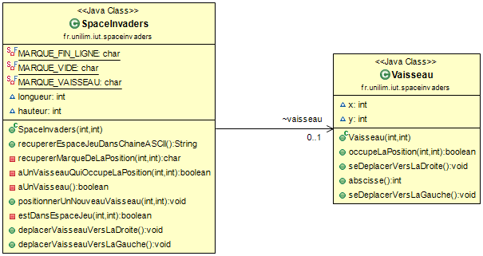

# spaceinvaders
## Sprints et fonctionnalités réalisées
---
## Semaine n°1: du 6 au 12 Avril
### Fonctionnalité n°1 : Déplacer un vaisseau dans l'espace de Jeu

- Story n°1 : Créer un espace de jeu
L'objectif est de créer un espace de jeu en écrivant les tests et en les validant.

- Story n°2 : Positionner un nouveau vaisseau dans l'espace de jeu
Ici le but sera de créer un vaisseau et de le positionner.

- Story n°3 : Déplacer un vaisseau vers la droite en tenant compte de sa dimension
L'objectif est de pouvoir déplacer le vaisseau vers la droite en prenant en compte sa position. Si celui-ci est à l'extrémité de l'espace de jeu, il sara immobile.

- Story n°4 : Déplacer un vaisseau vers la gauche en tenant compte de sa dimension
Story identique à la précédente mais du côté gauche.

#### Diagramme de Classe

#### Nuage de mots

---
## Semaine n°2: du 14 au 19 Avril
### Fonctionnalité n°2 : Dimensionner le vaiseau
- Etape n°1 : Positionner un nouveau vaisseau avec une dimension donnée

- Etape n°2 : Faire en sorte qu'il soit impossible de positionner un nouveau vaisseau qui déborde de l'espace de jeu

- Etape n°3 : Déplacer un vaisseau vers la droite en tenant compte de sa dimension

- Etape n°4 : Déplacer un vaisseau vers la gauche en tenant compte de sa dimension

---
## Semaine n°3 : du 04 au 09 Mai
### Fonctionnalité n°3 : 
